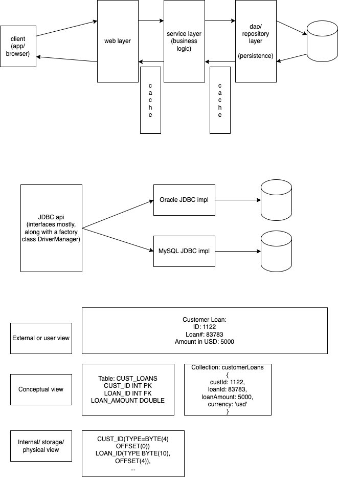
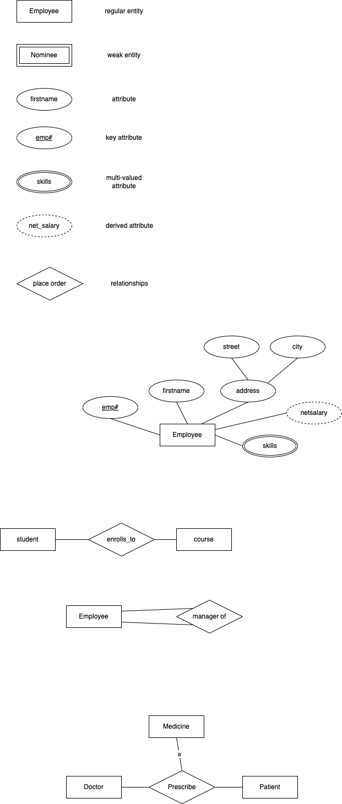

# Database concepts and ER modelling

1. What is data?
1. What is database?
1. What is a DBMS?
1. Different data models (historical)
    1. Flat
    1. network model
    1. hierarchical
    1. Relational model
1. ER modelling (and diagrams)
1. Normalization

### Data

-   Fact, text, images, sound, video, number - Meaningful stuffs
-   Piece of information
-   Building block of information
-   Examples: 'Vinod', 'Bangalore', '23-03-2023', 50, 'https://vinod.co/'

### Database

-   More organized collection of logically related data
-   All data related to HR management or Accounting or Sales or Stocks of products in the store, ...
-   Traditionally maintained in the form of book keeping, now in computers - Spreadsheets, flat files, DBMS

### Information

-   Processed data

### Metadata

-   Data about data

## Data models

1. Hierarchical model - Windows Registry, XML data formats, IMS (IBM Information Management System)
1. Network model - Most social media softwares, CA-IDMS, Neo4j
1. Relational model - Perceives data in the form of tables (or relations). Oracle, MS-SQL server, MySQL, MariaDB, PostgreSQL, IBM DB2, MS-Access,
1. Entity-Relationship Model - Communication language/tool. Describe entities/attributes/relaships between data.
1. Object oriented model - Oracle OODBMS, db4o, ObjectStore, GemStone
1. Document model - data is represented in the form of documents, with key/value, where a value itself can be another set of key/value or array of values. Mongodb, Couchbase, Amazon DocumentDB, Amazon DynamoDB
1. Columnar model - Apache cassandra, Google bigtable, Amazon Redshift. Data in columns rather than rows (as in RDBMS). Performance is high, and used in large scale analytics
1. Key/value model - Redis, Amazon DynamoDB, Riak

## Key concepts related to RDBMS

-   data is perceived as tables (or relations)
-   Relation must have a unique name in the database
-   Relation consists of rows (records, or tuples)
-   A Row is divided into (or made up of) columns (fields, or attribtes)
-   Value in all rows of a field must be of similar type (domain integrety)
-   Column values are supposed to be atomic
-   Rows must be identifiable uniqely - primary key
-   Not all column values for a row are available - null (not - zero, empty string, blank)

## ER Model

-   A very popular approach to desgin and represent relation databases
-   Graphical tool
-   Describes the entities, attributes of an entity and relationship between entities
-   Entities and relationships dipicted in the diagram become tables (or relations)
-   Attributes become columns of a table

### Entity

-   a real world object or concept that has some data (or information). Usually nouns are used to call them out.
-   For example, employee, customer, book, product,
-   Types of entities:
    1. Regular - have their own key attribute
    1. Weak - Do not have their own key attribute, but will use key attribute of another regular entity
        - For example, "Nominee" is not a customer in a bank, but it uses the customer_id of the actual customer for whom he/she is a nominee

### Attributes

-   Data represented by the entity
-   For example, for the entity employee, attributes may be firstname, lastname, email, address, phone_number, skills
-   Simple vs composite attribute
    -   Simple - cannot be divided further (for example, firstname, email, phone_number)
    -   Composite - can be split into components (further attributes) - (address -> house_no_name, street, city, state, .. )
-   Single vs multi-valued
    -   Single - one value per instance
    -   Multi-valued - single field containing multiple values (skills can be "java, c++, mysql" or "c++, oracle, javascript")
-   Stored vs derived attributes
    -   Stored - data is stored in the physical system
    -   Derived (or calculated) generated on the fly (usually by a "view" or the application)
        -   Experience (years-of-service) can be calculated based on "Today" and "Date of join" of the employee
        -   Net salary (salary+allowances-deductions) can be calculated if we know the salary

### Relationships between entities

-   Generally verbs
-   May or may not have attributes
-   For example, student registers to a course (student_courses), customer buys products (customer_orders)
-   Attributes of the student_courses can be - reg_datetime, course_fee, discount, faculty_id
-   Attributes of customer_orders - product_id, quantity, unit_price, order_date, discount_pct, order_status
-   Cardinality of relationships
    -   one-to-one
    -   one-to-many
    -   many-to-many
-   Degree of relationship
    -   Number of entities involved
    -   Unary - one
        -   Ram (employee) is the Manager for Shyam (employee)
    -   Binary - two
        -   Student enrolling to a course
        -   Customer buying a product
    -   Ternary - three
        -   Doctor prescribing a medince to a patient
        -   customer purchases product from a shop
-   Relationship participation
    -   total
        -   employee belongs to a department
    -   partial
        -   employee is a head-of-department

### Transforming ER diagram into relations (tables)

1. Map regular entities into relations
1. Composite attributes: use only the simple attributes of the composite attribute
1. Multi valued attributes - becomes a new a table/relation with a foreign key taken from the superior entity
    - FOR EXAMPLE, employee --> superior table
                   skills --> new table
                   employee_skills --> consists of emp#, skill#
                   101, 12
                   101, 20
                   101, 38
                   122, 20