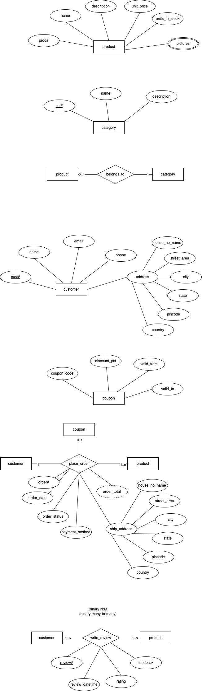
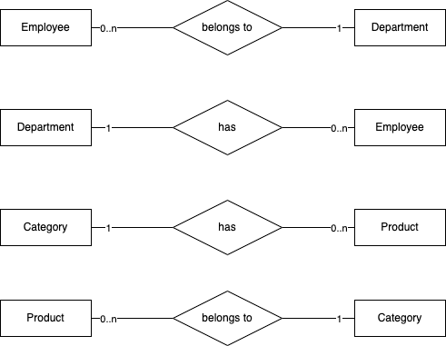
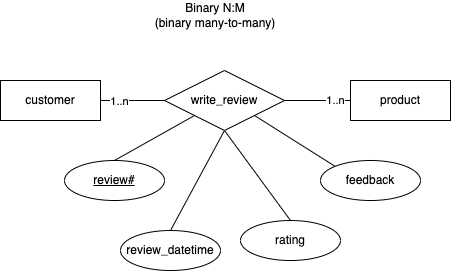
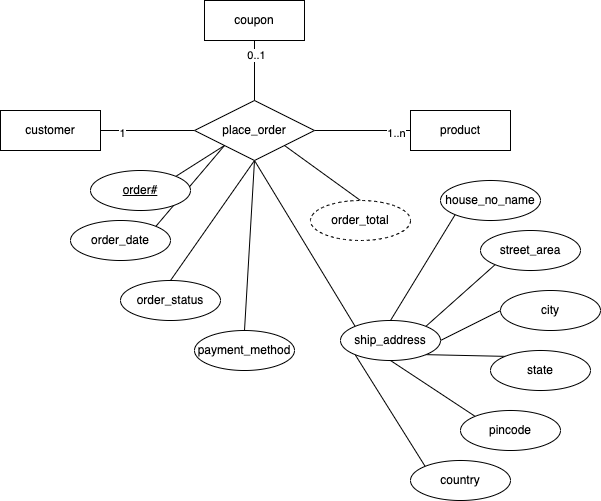
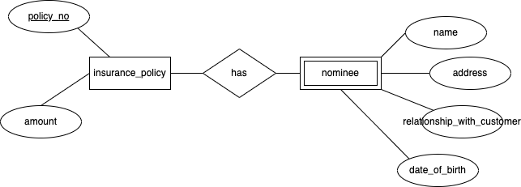

# Day 2 - RDBMS concepts

## Solution to the assignment problem statement

1. Identify the possible entities and relationships (or processes) that can be found in the scope of the problem statement.
    - Nouns (entities):
        - product (prod#, product_name, description, unit_price, pictures, units_in_stock)
        - category (cat#, category_name, category_description)
        - customer (cust#, customer_name, email, phone, address)
        - coupon (coup#, discount_pct, valid_from, valid_to)
    - verbs (relationships/processes)
        - customer buys product (or place order / checkout) applying coupons (if any)
            - attributes: order#, order_date, payment_method, order_status, shipping_address, order_total
        - customer reviews product (provides rating and feedback)
            - attributes: review#, review_datetime, rating, feedback

## Transforming ER diagrams into relations/ tables

1. Map regular entities to relations
1. Composite attributes - Use only the simple attributes from them
1. Multi-valued attributes - The multivalued attribute itself becomes a new relation, taking the primary key of the superior relation as a foreign key, and the combination of the superior_key and the multivalued attribute becomes the composite primary key

Keeping the above pointers in mind, let's have a look at the possible relations out of regular entities:

1. products (product_id, product_name, product_description, unit_price, units_in_stock)
1. product_pictures (product_id, picture)
1. categories (category_id, cagtegory_name, category_description)
1. customers (customer_id, name, email, phone, house_no_name, street_area, city, state, pincode, country)
1. coupons (coupon_code, discount_pct, valid_from, valid_to)

More pointers to consider (for relationships between entities)

1. Binary 1:1
    - 
    - The primary key of partial participant (eg, employee#) will become the foreign key of the total participant (eg, department)
    - employees (employee#, firstname, lastname,....)
    - departments (dept#, dept_name, location, hod_employee_id)
1. Binary 1:N
    - 
    - The primary key of the relation (table/entity) on the "1" side of the relationship becomes a foreign key in the relation (table/entity) on the "N" side of the relationship
    - employees (employee#, firstname, lastname, department#, ...)
    - products (product_id, product_name, product_description, unit_price, units_in_stock, category_id)
1. Binary N:M (many-to-many)
    - 
    - A new table is created to represent the relationship
    - contains two foreign keys, one from each of the entites participating in the relationship
    - In addition, the relationship itself, may produces attributes
    - the primary key of the new table is the combination of the two foreign keys
    - reviews (cust#, product#, review_datetime, rating, feedback)
1. Ternary relationship
    - 
    - represented by a new table/relation
    - the new table contains three foreign keys - one from each of the participating entities (primary keys)
    - the primary key of the new table can be a combination of the three primary keys coming from participating entities, or generally new key is created
    - in addition, the relationship itself may have attributes
    - orders (order#, customer#, coupon#, product#, order_date, status, payment_method, order_total, ship_house_no_name, ship_street_area, ship_city, ship_state, ship_pincode, ship_country, quantity)
1. weak entities
    - becomes a separate relation, with a foreign key taken from the superior entity
    - 
    - nominees (policy_id, name, address, ...)

## Assignment tables created using the ER diagram

-   products (product_id, product_name, product_description, unit_price, units_in_stock, category_id)
-   product_pictures (product_id, picture)
-   categories (category_id, cagtegory_name, category_description)
-   customers (customer_id, name, email, phone, house_no_name, street_area, city, state, pincode, country)
-   coupons (coupon_code, discount_pct, valid_from, valid_to)
-   reviews (cust#, product#, review_datetime, rating, feedback)
-   orders (order#, customer#, coupon#, product#, order_date, status, payment_method, order_total, ship_house_no_name, ship_street_area, ship_city, ship_state, ship_pincode, ship_country, quantity)
