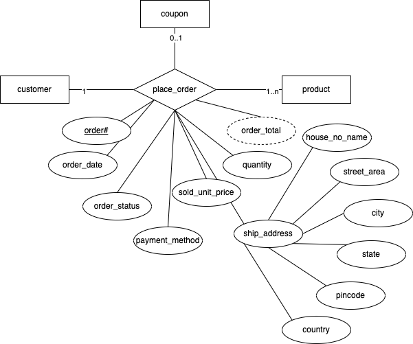

# Day 2 - RDBMS concepts

## Solution to the assignment problem statement

1. Identify the possible entities and relationships (or processes) that can be found in the scope of the problem statement.
    - Nouns (entities):
        - product (prod#, product_name, description, unit_price, pictures, units_in_stock)
        - category (cat#, category_name, category_description)
        - customer (cust#, customer_name, email, phone, address)
        - coupon (coup#, discount_pct, valid_from, valid_to)
    - verbs (relationships/processes)
        - customer buys product (or place order / checkout) applying coupons (if any)
            - attributes: order#, order_date, payment_method, order_status, shipping_address, order_total, quantity, sold_unit_price
        - customer reviews product (provides rating and feedback)
            - attributes: review#, review_datetime, rating, feedback

## Transforming ER diagrams into relations/ tables

1. Map regular entities to relations
1. Composite attributes - Use only the simple attributes from them
1. Multi-valued attributes - The multivalued attribute itself becomes a new relation, taking the primary key of the superior relation as a foreign key, and the combination of the superior_key and the multivalued attribute becomes the composite primary key

Keeping the above pointers in mind, let's have a look at the possible relations out of regular entities:

1. products (product_id, product_name, product_description, unit_price, units_in_stock)
1. product_pictures (product_id, picture)
1. categories (category_id, cagtegory_name, category_description)
1. customers (customer_id, name, email, phone, house_no_name, street_area, city, state, pincode, country)
1. coupons (coupon_code, discount_pct, valid_from, valid_to)

More pointers to consider (for relationships between entities)

1. Binary 1:1
    - 
    - The primary key of partial participant (eg, employee#) will become the foreign key of the total participant (eg, department)
    - employees (employee#, firstname, lastname,....)
    - departments (dept#, dept_name, location, hod_employee_id)
1. Binary 1:N
    - 
    - The primary key of the relation (table/entity) on the "1" side of the relationship becomes a foreign key in the relation (table/entity) on the "N" side of the relationship
    - employees (employee#, firstname, lastname, department#, ...)
    - products (product_id, product_name, product_description, unit_price, units_in_stock, category_id)
1. Binary N:M (many-to-many)
    - 
    - A new table is created to represent the relationship
    - contains two foreign keys, one from each of the entites participating in the relationship
    - In addition, the relationship itself, may produces attributes
    - the primary key of the new table is the combination of the two foreign keys
    - reviews (cust#, product#, review_datetime, rating, feedback)
1. Ternary relationship
    - 
    - represented by a new table/relation
    - the new table contains three foreign keys - one from each of the participating entities (primary keys)
    - the primary key of the new table can be a combination of the three primary keys coming from participating entities, or generally new key is created
    - in addition, the relationship itself may have attributes
    - orders (order#, customer#, coupon#, product#, order_date, status, payment_method, order_total, ship_house_no_name, ship_street_area, ship_city, ship_state, ship_pincode, ship_country, quantity, sold_unit_price)
1. weak entities
    - becomes a separate relation, with a foreign key taken from the superior entity
    - 
    - nominees (policy_id, name, address, ...)

## Assignment tables created using the ER diagram

-   products (product_id, product_name, product_description, unit_price, units_in_stock, category_id)
-   product_pictures (product_id, picture)
-   categories (category_id, cagtegory_name, category_description)
-   customers (customer_id, name, email, phone, house_no_name, street_area, city, state, pincode, country)
-   coupons (coupon_code, discount_pct, valid_from, valid_to)
-   reviews (cust#, product#, review_datetime, rating, feedback)
-   orders (order#, customer#, coupon#, product#, order_date, status, payment_method, order_total, ship_house_no_name, ship_street_area, ship_city, ship_state, ship_pincode, ship_country, quantity, sold_unit_price)

## Redundancy and Normalization

Problems due to redundancy

-   storage
-   insertion/deletion/modification anomalies

To solve this:

-   use integrety constraints
-   functional dependencies can be used to identify schemas with such problems and also to suggest refinements

Main refinement techniques:

-   decomposition
    -   replace ABCD with say for example, AB, BCD, ACD, ...

### What is actually normalization?

Tables in a schema designed based on ER model may have some amount of

-   inconsitency
-   uncertainity
-   redundancy

To eleminate these, we do some REFINEMENT.

-   called as normalization
-   different steps in normalization is called as "normal forms"
-   1NF, 2NF, 3NF
-   BCNF
-   first we need to understand "functional dependencies"

### Functional dependencies

-   In a given relation R, X and Y are attributes. Attribute Y is functionally dependent on attribute X, if each value of X determines exactly one value of Y. This is represented as X -> Y
-   X -> Y does not automatically imply Y -> X
-   
-   If we know the "marks" then we can determine the "grade". We say "Marks" -> "Grade".
    -   In other words, "grade" functionally depends on "marks"

Types of functional dependencies:

1. Full functional dependency
2. Partial functional dependency
3. Transitive dependency

Consider a relation:

Report (student#, course#, course_name, instructor_name, room_no, marks, grade, student_name, date_of_birth)

-   student# --> student rollno
-   course# --> course number
-   course_name --> name of the course taken by this student
-   instructor_name --> name of the faculty who delivered the course
-   room_no --> the room that was assigned to an instructor
-   marks --> scored by the student with student# on the course with course#
-   grade --> obtained by the student with student# in the course with course#

Functional dependencies:

-   (student#, course#) -> marks
-   student# -> student_name, date_of_birth
-   course# -> course_name
-   course# -> instructor_name (assumption: one course is taught by only one instructor)
-   instructor_name -> room_no (assumption: every instructor has his/her own room)
-   marks -> grade

-   Here only marks is fully functionally dependent on the key attributes
-   The attribute (non-key) course_name, instructor_name and room_no have dependency partially on the keys (depend only on course# and not on student#)
-   student#,course# -> marks and marks -> grade and hence you can say (student#,course#) -> grade (transitive dependency)
-   course# -> instructor_name and instructor_name -> room# and hence given a course# we can determine the room#

## Normal form - 1NF (first normal form)

-   A table/relation is in 1NF if
    -   there are no duplicate rows in the table (i.e, we have a primary key)
    -   each cell is single-valued (atomic)
    -   entries in a column (attribute, field) are all of same kind

## Normal form - 2NF (second normal form)

-   A relation is in 2NF if and only if
    -   it is in 1NF
    -   No partial dependencies exist between non-key attributes and the key attributes
    -   to make our example table compliant with 2NF we need to remove partial dependencies.
    -   students (student#, student_name, date_of_birth)
    -   courses (course#, course_name, instructor_name, room_no)
    -   student_marks (student#, course#, marks, grade)

Let's check if the following relation is in compliance with 2NF. If not, let's refine the same.

orders (order#, customer#, coupon#, product#, order_date, status, payment_method, order_total, ship_house_no_name, ship_street_area, ship_city, ship_state, ship_pincode, ship_country, quantity, sold_unit_price)

order# -> order_date, status, payment_method, order_total, ship_house_no_name, ship_street_area, ship_city, ship_state, ship_pincode, ship_country, customer#, coupon#
order#, product# -> quantity, sold_unit_price

order# product# quantity
1122 76 1
1122 78 2
1122 23 7
1782 12 1
1782 76 3

After the 2NF, we are left with the following tables:

-   products (product_id, product_name, product_description, unit_price, units_in_stock, category_id)
-   product_pictures (product_id, picture)
-   categories (category_id, cagtegory_name, category_description)
-   customers (customer_id, name, email, phone, house_no_name, street_area, city, state, pincode, country)
-   coupons (coupon_code, discount_pct, valid_from, valid_to)
-   reviews (cust#, product#, review_datetime, rating, feedback)
-   orders (order#, order_date, status, payment_method, order_total, ship_house_no_name, ship_street_area, ship_city, ship_state, ship_pincode, ship_country, customer#, coupon#)
-   order_products (order#, product#, quantity, sold_unit_price)

### 3NF

-   a relation is in 3NF if and only if
-   it is already in 2NF
-   no transitive dependencies exist between non-key attributes and key attributes

in the example of student report, we can create a floating table like this:

Table: Marks_Grade

| u_bound | l_bound | grade |
| ------- | ------- | ----- |
| 100     | 81      | A+    |
| 80      | 61      | A     |
| 60      | 41      | B     |
| 40      | 0       | C     |
