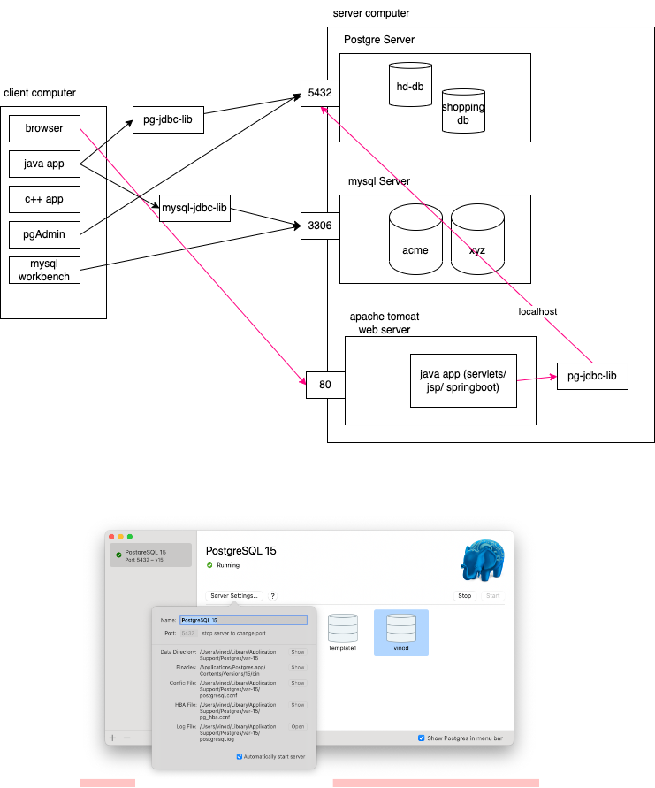

# Introduction to PostgreSQL and DDL/DML commands



## What is PostgresSQL?

-   Open source ORDBMS
-   created in 1986, major changes in 1995 (Postgres95)
-   Developed by University of California
-   Support for ANSI standard SQL
-   complex queries
-   stored procedure and function
-   transactions

Apart from the above features, Postgres can also be extended by the users

-   data types
-   functions
-   operators
-   procedure
-   triggers
-   index methods

## Database

A collection of related objects such as:

-   tables
-   views
-   sequences
-   indexes
-   stored procedures
-   stored functions
-   triggers
-   types
-   operators

```sql
CREATE DATABASE mydb; -- creates a new database called mydb

\c mydb; -- connecting to mydb
```

### Tables

-   the fundamental storage unit
-   consists of rows and columns
-   all other db objects work with/on the tables

```sql
CREATE TABLE [IF NOT EXISTS] table_name (
    column1 datatype([length]) column1_constraints,
    column2 datatype([length]) column2_constraints,
    ...
    table_constraints
)
```

### Datatypes in Postgres

-   boolean or bool
    -   1, yes, y, true, t --> true
    -   0, no, n, false, f --> false
-   Characters
    -   char, varchar, text
-   Numerics
    -   integers
        -   smallint, int, bigint, serial, bigserial
    -   floating point numbers
        -   float, real, float8, numeric(p, s)
-   Temporal data types
    -   Allow you to store date and/or time
        -   DATE
        -   TIME
        -   TIMESTAMP
        -   INTERVAL
            -   interval [fields] [(p)]
            -   interval '2 months ago'
            -   interval '3 hours 20 minutes'
            -   select now() - interval '100 days' as "100 days ago"
            -   select now() + interval '22 days'
-   Arrays
    -   can store collection of strigs, integers, etc. in a single column value
-   UUID
    -   we have to enable the "uuid-ossp" module
    -   `CREATE EXTENSION IF NOT EXISTS "uuid-ossp"`
    -   After that, we can use the function `uuid_generate_v4()`
-   JSON
-   HSTORE
    -   allows you to store key/value pairs as a single column value
    -   need to enable by creating extension hstore

Example 1 - create a basic table

```sql
CREATE TABLE persons (
    id int,
    name varchar(25),
    email varchar(255),
    constraint pk_id primary key (id)
);
```

Syntax for inserting a record:

```sql
INSERT INTO table_name [(column_list)]
VALUES (value_list);

```

For example,

```sql

INSERT INTO persons VALUES (1, 'Vinod', 'vinod@vinod.co');
INSERT INTO persons (id, name) VALUES (2, 'Shyam');
INSERT INTO persons (id, email, name) VALUES (3, 'kumar@xmpl.com', 'Kumar');
INSERT INTO persons (name, email) VALUES ('John Doe', 'john@xmpl.com'); -- error; primary key constraint failure
```

To remove a table from the database, use the `DROP TABLE` command

```sql
DROP TABLE [IF EXISTS] table_name;
DROP TABLE IF EXISTS persons;
DROP TABLE persons;
```

Example 1 - create a basic table with constraints

```sql
CREATE TABLE customers (
    id serial primary key,
    name varchar(25) not null,
    email varchar(255) not null unique,
    phone varchar(50),
    city varchar(50) default 'Bangalore',
    constraint unq_phone unique(phone)
);
```

Add few records to the customers table:

```sql
INSERT INTO customers (name, email) VALUES ('Vinod Kumar', 'vinod@vinod.co');
INSERT INTO customers (name, email, phone) VALUES ('Vinod Khanna', 'vinod@xmpl.com', '9879856745');
INSERT INTO customers (name, email) VALUES ('Shyam Sundar', 'shyam@xmpl.com');
INSERT INTO customers (name, email) VALUES ('Rajesh Kulkarni', 'rajesh@xmpl.com');

```

The `serial` data type used for primary key creates a new sequence (for example, customers_id_seq). We can find the last produced value from the sequence using this command:

```sql
select last_value from customers_id_seq;
```

### Check constraints

-   allow you to specify if value of a coulmn (during insert or update) are as per the condition or not.
-   can be used both as column level or table level

```sql
drop table if exists employees;

create table employees (
    id bigserial primary key,
    firstname varchar(50) not null,
    lastname varchar(50),
    birth_date date,
    hire_date date,
    salary numeric(15,2) check (salary>=25000),
    constraint employees_chk_hire_date_birth_date check (hire_date > birth_date),
    constraint employees_chk_birth_date  check (birth_date > '1964-01-01')
);

insert into employees (firstname, lastname, birth_date, hire_date, salary)
values ('Kishore', 'Kumar', '1975-01-22', '2004-04-01', 67000);


insert into employees (firstname, lastname, birth_date, hire_date, salary)
values ('Ramesh', 'Kumar', '1975-09-22', '1975-04-01', 67000);

insert into employees (firstname, lastname, birth_date, hire_date, salary)
values ('Ramesh', 'Kumar', '1975-09-22', '2005-04-01', 17000);

insert into employees (firstname, lastname, birth_date, hire_date, salary)
values ('Ramesh', 'Kumar', '1975-09-22', '2005-04-01', 75000);

select * from employees;

```

### Example of using Array data type in a table

```sql
CREATE TABLE friends (
    id serial primary key,
    name varchar(50) not null,
    phone_numbers text[]
);


insert into friends (name, phone_numbers)
    values ( 'Shyam', array['9998877654', '7896547722']),
        ('Ramesh', '{"7658769871", "7894562341"}');

insert into friends (name, phone_numbers) values ('Vinod', array['9731424784', '9844083934', '8026999190']);
select name, phone_numbers, phone_numbers[1] as "Primary" , phone_numbers[2] as "Secondary" from friends;

select id, name, unnest(phone_numbers) as phone from friends;
select id, name from friends where '9731424784' = any(phone_numbers);
```

### Example of using UUID data type

```sql
create table users (
    id uuid primary key,
    username varchar(50) not null unique,
    password varchar(255)
);

create extension if not exists "uuid-ossp";

insert into users values
(uuid_generate_v4(), 'harish.rao', 'topsecret'),
(uuid_generate_v4(), 'ramesh.kumar', 'topsecret'),
(uuid_generate_v4(), 'ravi.ssp', 'topsecret');

```

## JSON - JavaScript Object Notation

-   A standard for data exchange.
-   https://json.org/
-   Consists of either an object or an array of values
-   A value can be one of these:
    -   string --> data enclosed in double quotation marks
        -   "Vinod"
    -   number --> digits consisting of at the max one dot.
        -   12345.67
        -   1234
        -   .34
    -   array --> a set of comma separated values enclosed in square brackets
        -   [10, 20, "Vinod", true, [1,2,3], {"x": 39, "y": 44}, null, null, 293]
        -   []
        -   [1200]
        -   [120, 304]
    -   object --> a set of key/value pairs enclosed with in curly braces
        -   {"name": "Vinod", "isMarried": true, "address": {"city": "Bangalore", "country": "India"}, "phones": ["9731424784", "9844083934"], "fax": null}
        -   {}
        -   {"name": "Vinod"}
        -   {"name": "Vinod", "age": 49}
    -   true/false
    -   null

### Using `json` data type in a table

```sql

CREATE TABLE customer_orders (
    id serial primary key,
    order_info json not null
);


INSERT INTO customer_orders (order_info) VALUES
    ('{"customer_id": 393, "order_date": "2022-10-29", "order_total": 4500}'),
    ('{"customer_id": 393, "order_date": "2022-12-30", "order_total": 9800}');


select * from customer_orders;
select id, order_info->'order_total' from customer_orders;
select id, order_info->'order_total' as order_total from customer_orders;
select id, order_info->'order_date' as order_date, order_info->'order_total' as order_total from customer_orders;
select id, order_info->>'order_date' as order_date, order_info->'order_total' as order_total from customer_orders;

-- notice the ->> in the last command.

select *from customer_orders where order_info->>'order_date' = '2022-10-29';
select * from customer_orders where cast(order_info->>'order_total' as numeric) > 5000;

```

### Using the HSTORE data type in a table

```sql

create extension if not exists hstore;

CREATE TABLE books (
    id serial primary key,
    title varchar(100) not null,
    remarks hstore
);


INSERT INTO BOOKS (title, remarks) VALUES
    ('Let us C', '
    "author" => "Yashwant Kanitkar",
    "price" => "299.0",
    "publisher" => "BPB Publications"
    '),
    ('PostgreSQL tutorial', '
    "author" => "Vinod Kumar K",
    "price" => "999.0",
    "publisher" => "KVinod Inc."
    ');

select id, title, remarks->'author' as author from books;
select id, title, remarks->'author' as author from books where cast(remarks->'price' as numeric) >500;


```

## UPDATING EXISTING ROWS OF A TABLE

```sql
    UPDATE table_name
    SET column1=value1 [, column2=value2, ...] [WHERE condition]
```

Examples:

```sql
UPDATE employees SET lastname = 'Kamath'; -- sets the lastname for all employees to 'Kamath'
UPDATE employees SET lastname = 'Kumar' WHERE id in (1, 4); -- update specific rows based on 'id'

update books set remarks = remarks || '"price"=>"599.0"' where id = 2; -- existing attribute
update books set remarks = remarks || '"no_of_pages"=>"187"' where id = 2; -- new attribute
update books set remarks = remarks || '"shipping"=>"free"'; -- new attribute to all rows

select id, title from books where remarks ? 'no_of_pages';

update books set remarks = delete(remarks, 'publisher') where id=1;

```

## Working with Foreign keys

-   Foreign key is a key applied on a child table such that the column on which FK is applied on refers to the values from the parent table's primary key
-   For example, PROUDCTS is a table that has a column called CATEGORY_ID which is a foreign key to the CATEGORIES table, such that the values of CATEGORY_ID column in the PRODUCTS table, comes from the PRIMARY KEY column of the CATEGORIES table.

SYNTAX:

```sql
    CONSTRAINT constraint_name
    FOREIGN KEY (foreign_key_column)
    REFERENCES parent_table_name [(primary_key_column)]
    [ON DELETE delete_action]
    [ON UPDATE update_action]
```

DELETE_ACTION and UPDATE_ACTION can be one of the following:

-   SET NULL
-   SET DEFAULT
-   RESTRICT
-   NO ACTION
-   CASCADE

```sql

CREATE TABLE categories(
    id serial primary key,
    name varchar(50) not null,
    description text
);

CREATE TABLE products (
    id serial primary key,
    name varchar(50) not null,
    unit_price numeric,
    category_id int,
    CONSTRAINT FK_PRODUCTS_CATEGORIES FOREIGN KEY (category_id) REFERENCES categories(id)
);

insert into categories (name) values ('Computer peripherals'), ('Lifystyle products');

insert into products (name, unit_price, category_id) values
('Samsung Monitor', 8300, 1),
('Apple magic mouse', 8000, 1),
('Fire boltt smartwatch', 1800, 2);


ALTER TABLE products DROP CONSTRAINT FK_PRODUCTS_CATEGORIES;

ALTER TABLE products
ADD CONSTRAINT FK_PRODUCTS_CATEGORIES
FOREIGN KEY (category_id)
REFERENCES categories
ON DELETE SET NULL;

delete from categories where id=1;
-- deletes the record from categories and updates the products.category_id to NULL


alter table products drop constraint fk_products_categories;

alter table products add constraint fk_products_categories
foreign key (category_id) references categories on delete cascade;

delete from categories where id=2;
-- deletes all records from products where category_id=2 also!!!

-- add a default value to the category_id column in products table
alter table products
alter category_id set default 0;

insert into categories values (0, 'Unknown Category', null);

alter table products drop constraint fk_products_categories;

alter table products add constraint fk_products_categories
foreign key (category_id) references categories on delete set default;

update products set category_id = 3;

delete from categories where id=3;
-- sets the column products.category_id to 0 (since that is the default value for the column in the table)

alter table products drop constraint fk_products_categories;

alter table products add constraint fk_products_categories
foreign key (category_id) references categories on delete set default on update cascade;

update categories set id=3 where id=5;
-- updates all category_id in products table to 3 where it was 5 earlier
```

### Working with composite primary key (and corresponding foreign key)

```sql

create table t1(
    c1 int not null,
    c2 int not null,
    c3 text,
    constraint pk_t1 primary key (c1, c2)
);

insert into t1 values (1, 1, 'one one'), (1, 2, 'one two'), (2, 1, 'two one'), (2, 2, 'two two');

create table t2(
    id serial primary key,
    name text,
    col1 int,
    col2 int,
    constraint fk_t1_t2 foreign key (col1, col2) references t1
);

insert into t2 (name, col1, col2) values
('a', 1, 1),
('n', 1, 2),
('x', 1, 1);

```


### Updating JSON fields of a row/column

```sql
UPDATE customer_orders
set order_info = jsonb_set(order_info, '{order_status}', '"PENDING"');

-- TBD: create extension for the above to work!
```