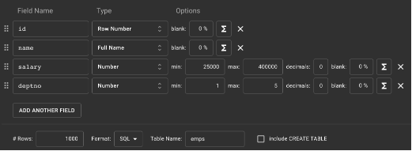

# Working with SQL SELECT statements

[note:]

In PSQL shell, we can use `\! os_command` to run any OS command like `cls` in Windows.

```sh
\! cls
\! dir
```

```sh
\! clear
\! ls -l
\! pwd
```

You can change the orientation of the query output using the `\x on` or `\x off` options in psql.

Executing SQL commands from a file:

-   From the OS terminal (command prompt in MS-Windows)
    -   `psql -U postgres -d mydb -f ./customers.sql`
    -   `psql -U postgres -d mydb -f ~/Desktop/INFOSYS-RDBMS-POSTGRES-MARCH-2023/day-05/customers.sql`
    -   `psql -U postgres -d mydb -f /Users/vinod/Desktop/INFOSYS-RDBMS-POSTGRES-MARCH-2023/day-05/customers.sql`
-   From psql prompt
    -   `\i ./customers.sql` -- assuming that customers.sql is in your current working directory
    -   `\i ~/Desktop/INFOSYS-RDBMS-POSTGRES-MARCH-2023/day-05/customers.sql`
    -   `\i /Users/vinod/Desktop/INFOSYS-RDBMS-POSTGRES-MARCH-2023/day-05/customers.sql`

Notes:

1. SELECT is the command to query tables and views
1. It is one of the most commonly used SQL command
1. It can become very very complex for complex queries

Some of the most important clauses of SQL SELECT statement:

-   SELECT --> specifies the column or expressions list to be retrieved (projection)
-   FROM --> specifies the list of one or more tables
-   DISTINCT --> selects unique results
-   ORDER BY --> sorts the result
-   WHERE --> filters the result (selection)
-   LIMIT or FETCH --> can limit the number of rows output
-   GROUP BY --> allows us to fetch summary data
-   HAVING --> similar to WHERE clause, but with the grouped data
-   INNER JOIN, LEFT JOIN, RIGHT JOIN, FULL JOIN, CROSS JOIN --> fetch data from multiple tables
-   UNION, INTERSECT, EXCEPT --> perform algebra operations on tables (which are set of data)

```sql
    -- very basic format:
    SELECT select_list | *
    FROM table;
```

Some examples:\*

```sql

SELECT * FROM customers; -- fetches all rows from the table and each row will have every column (*)

SELECT firstname, lastname, city FROM customers; -- projection. Filtering of columns. Vertical filtering.


```

### Ordering the output

You can use the `ORDER BY` clause to arrange the output records.

```sql

SELECT select_list
FROM table
[ORDER BY column1 [ASC|DESC] [NULLS FIRST/LAST] [, column2 [ASC|DESC] [NULLS FIRST/LAST], ...]]

```

Example for DISTINCT ON:



```sql

create table emps(
    id serial primary key,
    name varchar(50) not null,
    salary numeric,
    deptno numeric
);

-- to import data, run this command inside the PSQL shell
-- \i emps.sql

-- display the one row for each department, where the row is of the employee earning max salary
select distinct on (deptno) deptno, name, salary from emps order by deptno, salary desc;

-- display the one row for each department, where the row is of the employee earning min salary
select distinct on (deptno) deptno, name, salary from emps order by deptno, salary;

-- display the one row for each department, where the row is of the employee with alphabatically first name
select distinct on (deptno) deptno, name, salary from emps order by deptno, name;

-- display the one row for each department, where the row is of the employee with alphabatically last name
select distinct on (deptno) deptno, name, salary from emps order by deptno, name desc;

-- display the one row for each department, where the row is of the employee with the smallest id in that dept
select distinct on (deptno) deptno, id, name, salary from emps order by deptno, id;
```


### Fetch instead of limit and offset

```sql
SELECT_STATEMENT
[OFFSET skip_count {ROW | ROWS}]
[FETCH {FIRST | NEXT } [row_count] {ROW | ROWS} ONLY]

```

