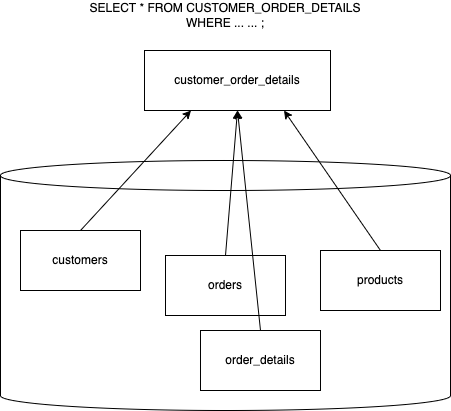

# View

-   A Stored object in the database
-   Named query
    -   The actual query itself is stored in the database with a name, that can be used as a source of data (like a table) in a select statement. In some cases, they can also be used for insertion/updation/deletion of data (UPDATABLE VIEWS).
-   Two types:
    -   Regular views: do not store the data in the database
        -   Each time you query the view, the SQL SELECT statement behind the view, will be executed, getting the latest data.
    -   Materialized views: stores the result of the query in the database, and can be periodically refreshed. It is possible, that the data coming from this view may be a stale data. We do have the option of refreshing.



SYNTAX:

```sql

    CREATE [OR REPLACE] view_name AS query;

```

EXAMPLE:

```sql

    create or replace view product_info
    as
    select product_id, product_name, round(unit_price*units_in_stock) as stock_value,
        category_name, description as category_description,
        company_name as supplier_name, format('%s (%s)', contact_name, contact_title)  as contact_person
    from products
    join categories using (category_id)
    join suppliers using (supplier_id)
    where units_in_stock>0
    order by product_id;

```

After this, we can query "product_info", as if it is a table.

```sql
select * from product_info where stock_value > 2000;
```

Another example.

Let's say we want to get complete order details (like the order total, who's the customer, employee, shipper etc).

```sql

create or replace view ORDER_DETAILS_VIEW AS
SELECT
    O.ORDER_ID, ORDER_DATE, REQUIRED_DATE, -- ORDERS TABLE
    CASE
        WHEN SHIPPED_DATE IS NULL THEN 'PENDING'
        WHEN SHIPPED_DATE < REQUIRED_DATE THEN 'DELIVERED EARLY'
        ELSE 'DELAYED DELEVERY'
    END AS ORDER_STATUS, -- ORDERS TABLE
    ROUND(SUM(OD.UNIT_PRICE*OD.QUANTITY*(1-OD.DISCOUNT))) AS ORDER_TOTAL, -- ORDER_DETAILS TABLE
    C.COMPANY_NAME AS CUSTOMER_NAME, C.CITY AS CUSTOMER_CITY, C.PHONE AS CUSTOMER_PHONE, -- CUSTOMERS TABLE
    FORMAT('%s %s %s', TITLE_OF_COURTESY, LAST_NAME, FIRST_NAME) AS EMPLOYEE_NAME, -- EMPLOYEES TABLE
    S.COMPANY_NAME AS SHIPPED_BY, S.PHONE AS SHIPPER_PHONE, -- SHIPPERS TABLE
    SHIP_NAME, SHIP_ADDRESS, SHIP_CITY, SHIP_REGION, SHIP_POSTAL_CODE, SHIP_COUNTRY -- ORDERS TABLE
FROM ORDERS O
JOIN ORDER_DETAILS OD USING (ORDER_ID)
JOIN CUSTOMERS C USING (CUSTOMER_ID)
JOIN EMPLOYEES E ON E.EMPLOYEE_ID=O.EMPLOYEE_ID -- WITH OUT THE "USING" KEYWORD
JOIN SHIPPERS S ON SHIP_VIA=SHIPPER_ID
GROUP BY O.ORDER_ID, C.COMPANY_NAME, C.CITY, C.PHONE, TITLE_OF_COURTESY, LAST_NAME, FIRST_NAME, S.COMPANY_NAME, S.PHONE, SHIP_NAME, SHIP_ADDRESS, SHIP_CITY, SHIP_REGION, SHIP_POSTAL_CODE, SHIP_COUNTRY
ORDER BY ORDER_ID;

```

## Updatable views

In PostgreSQL, a view is updatable if it meets the following rules:

-   The defining query of the view must have exactly one single entry in the FROM clause, which an be a table, or another UPDATABLE VIEW
-   The defining query must not contain these: GROUP BY, HAVING, LIMIT, OFFSET, DISTINCT, UNION, INTERSECT, EXCEPT
-   The defining query must not use one of these: any set returning function, any aggregate functions like SUM, AVG, COUNT etgc
-   The underlying must contain all the not-null columns

For example,

```sql
create or replace view us_customers
as select company_name, contact_name, contact_title, city, region, postal_code
from customers where country = 'USA';
```
