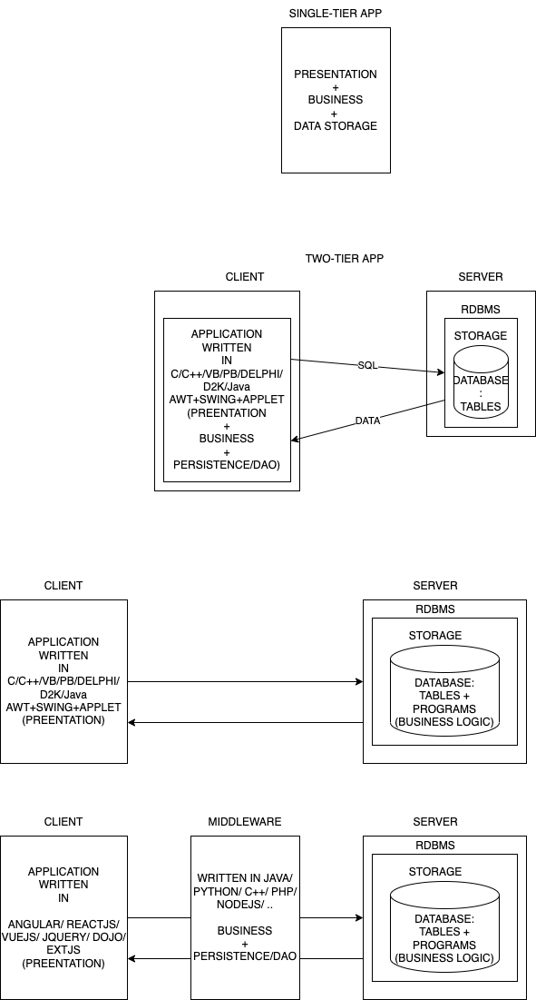

# Programming in PostgreSQL



## Syntax for a PL/pgSQL anonymous block

```sql

DO
'DECLARE
    -- variable declarations
BEGIN
    -- sql commands and programming constructs
END;';

```

For example,

Say we want to find and display the number of customers.

```sql
DO
'DECLARE
    customer_count int;
BEGIN
    select count(*)
        into customer_count
        from customers;

    raise notice ''There are % customers'', customer_count;
END;';
```

or

```sql
DO
E'DECLARE
    customer_count int;
BEGIN
    select count(*)
        into customer_count
        from customers;

    raise notice \'There are % customers\', customer_count;
END;';
```

We can simplify this using the dollar-quoted string, like this:

```sql
DO
$$
DECLARE
    employee_count int;
BEGIN
    select count(*)
        into employee_count
        from employees;

    raise notice 'There are % employees', employee_count;
END;
$$;
```

### Syntax of a PL/pgSQL block

```sql
[<<label_name>>]
[DECLARE
    <<variable declarations>>
]
BEGIN
    -- SQL statements and Program constructs
END [label_name];

```

-   Use the `label_name` only if there are nested blocks and an `exit` statement is used to exit a particular block


### Using variables in a PL/pgSQL block

-   Declare the variable in the declaration block
    -   use the data type and an optional default value
    ```sql
        DECLARE
            v_first_name varchar(50);
            v_city varchar(50) := 'Bangalore';
        BEGIN
    ```
    -   End the variable declaration with a semicolon
    -   Assignment of default value must be done using the `:=` notation.
    -   We also use the `=` symbol but mostly in conditional expressions
    ```sql
        select first_name, city
            into v_first_name, v_city
            from employees
            where employee_id = 5;
    ```
    -   The data type can also be borrowed from the column's type of a table
    ```sql
    DO $$
        DECLARE
            first_name employees.first_name%type;
            city employees.city%type;
        BEGIN
            select first_name, city
                into first_name, city
                from employees
                where employee_id = 5;
            raise info 'The employee whose id is % is % and lives in %', 5, first_name, city;
        END;
    $$;
    ```

### Syntax of the `SELECT` statement inside a PL/pgSQL block

```sql
    SELECT select_list
        INTO <variable_list|record_type_variable|row_type_variable>
        ...
        ...
```

-   One very important point to be noted is that the `SELECT` must produce a single row.
    -   else, only the first row content is assigned to the variables
-   We can collect all columns of a row (of table) into a single variable of type called `rowtype`

    ```sql
    DO $$
        DECLARE
            emp EMPLOYEES%rowtype;
            -- emp is a like a struct variable with child variables having the same name as the columns of EMPLOYEES table
            -- They can be accessed using the dot (.) notatation
            -- For example, emp.first_name or emp.city
        BEGIN
            SELECT *
                INTO emp
                FROM EMPLOYEES
                WHERE EMPLOYEE_ID = 5;
            raise info 'The employee whose id is % is % and lives in %', 5, emp.first_name, emp.city;
        END;
    $$;
    ```

### PgSLQ's RECORD type variables

-   similar to rowtype, can hold only one result set
-   no predefined structure like the rowtype
-   type is assigned based on the column_list in the SELECT statement


For example,

```sql
DO $$
    DECLARE
        emp record;
    BEGIN
        SELECT first_name, last_name, title_of_courtesy, city
            INTO emp -- now the structure of emp is decided and will have the child variables: first_name, last_name, title_of_courtesy, city
            FROM employees
            WHERE employee_id=1;
        raise info 'The employee whose id is % is % and lives in % (%)'
			, 1, concat(emp.title_of_courtesy, emp.first_name, ' ', emp.last_name), emp.city, emp.country;
    END;
$$;
```